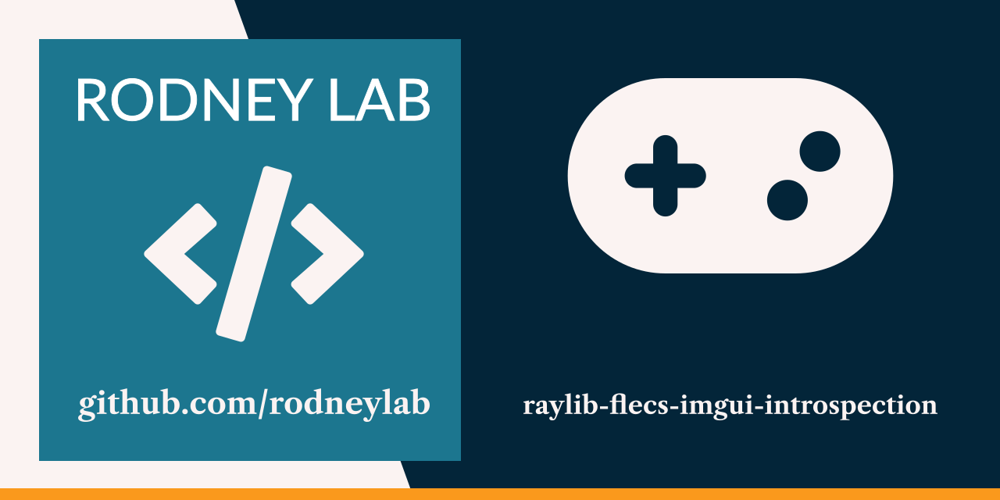
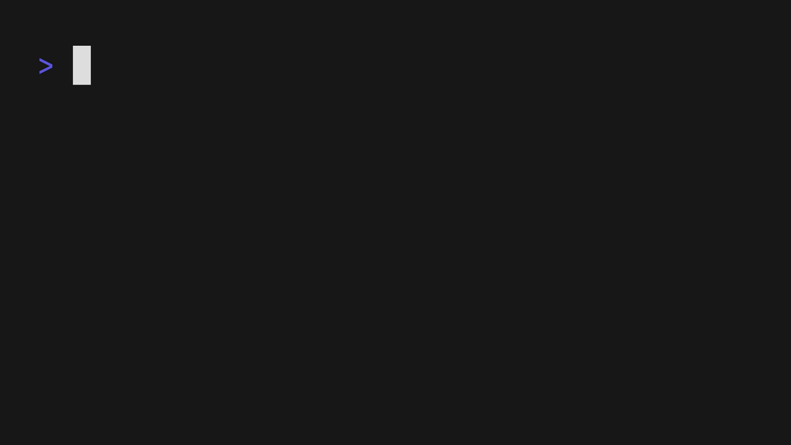

<p align="center">
  <a aria-label="Open Rodney Lab site" href="https://rodneylab.com" rel="nofollow noopener noreferrer">
    
  </a>
</p>
<h1 align="center">
  raylib Flecs ImGui Introspection
</h1>

# raylib-flecs-imgui-introspection

CMake project based Jolt physics raylib Hello World, showing how to integrate Flecs, Dear ImGui and Raylib to add physics introspection.  The code accompanies the
Rodney Lab
<a aria-label="" href="https://rodneylab.com/using-jolt-with-flecs-dear-imgui/">article on
using Jolt with Flecs and Dear ImGui</a>, which provides some pointers on getting
start with and setting up Jolt with raylib. If you have any questions, please
drop a comment at the bottom of that page.

## 🖥️ Usage



Requires [CMake](https://cmake.org/getting-started/) and a C++ compiler.

Clone the repo then run:

```shell
mkdir .build
cd .build
cmake ..
cmake --build .
./bin/RaylibFlecsImGuiIntrospection
```

With the game running, press the <kbd>F9</kbd> key to bring up the debug
interface and close the preview, or use <kbd>F9</kbd> again to close it.

## ☎️ Issues

Feel free to jump into the
[Rodney Lab matrix chat room](https://matrix.to/#/%23rodney:matrix.org).
